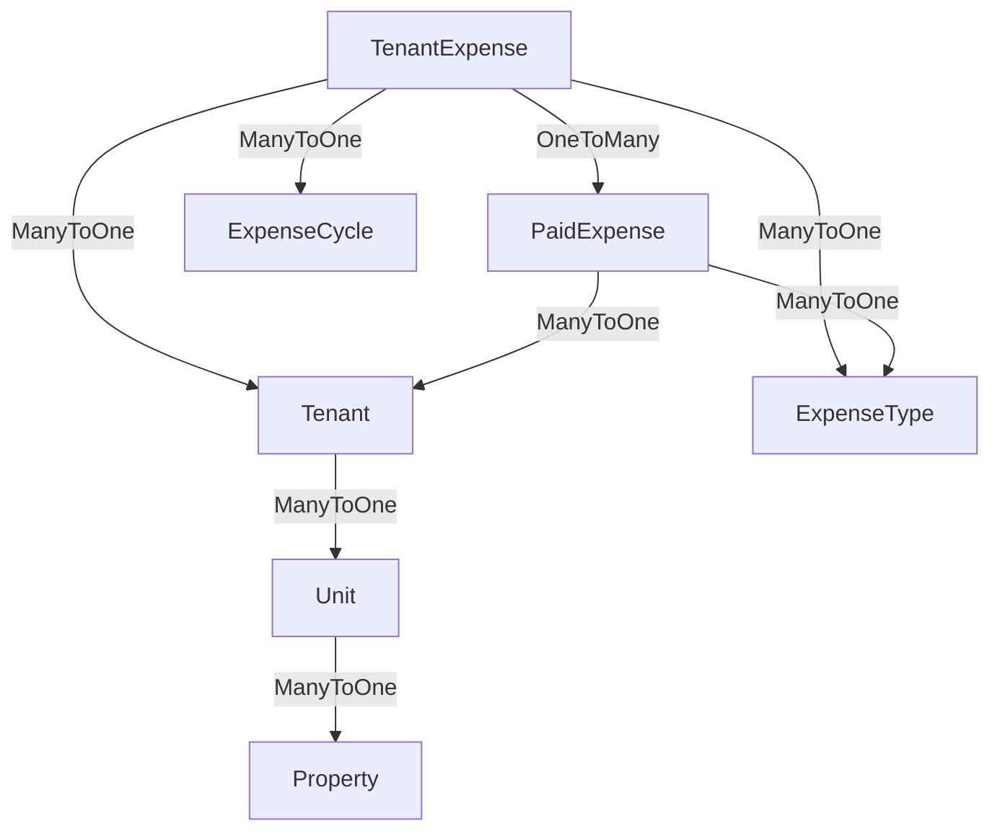

# Pending Amount Calculation Logic

## Overview
This document describes the logic and database changes implemented to calculate pending/due amounts for tenants, units, and properties in the KirayaDoor system.

---

## Database Changes

### 1. **TenantExpense Table - New Column**
- **Column Name**: `TenantExpenseEndDate` (datetime2, NULL)
- **Type**: nullable DateTime
- **Purpose**: Tracks when a tenant expense stops (e.g., when tenant moves out or expense is no longer applicable)
- **Default**: NULL (indicates ongoing/active expense)
- **Impact**: Allows system to calculate cycles only until the end date

### 2. **PaidExpense Table - New Column**
- **Column Name**: `TenantExpenseId` (int, NULL, FK)
- **Type**: nullable Foreign Key to TenantExpense
- **Purpose**: Links individual payments to specific recurring expenses for tracking
- **Default**: NULL (allows for manual payments not tied to a specific recurring expense)
- **Relationship**: One TenantExpense → Many PaidExpenses
- **Impact**: Enables accurate matching of payments to recurring expenses

---

## Calculation Logic

### Core Concept
```
Pending Amount = (Expected Amount) - (Total Paid Amount)

Where:
  Expected Amount = Number of Cycles Due × Amount Per Cycle
  Total Paid Amount = Sum of all PaidExpenses linked to that TenantExpense
  Number of Cycles Due = Based on cycle type and date range
```

### Cycle Calculation Algorithm

The system calculates the number of cycles due based on the expense cycle type. **Important: TenantExpenseStartDate is when the FIRST payment becomes due (advance payment). This counts as cycle 1. Only complete cycles after that are counted. No pro-rata amounts.**

#### 1. **OneTime Cycle**
```
If TenantExpenseStartDate <= Today's Date:
  Cycles Due = 1
Else:
  Cycles Due = 0
```
- A one-time expense becomes due on the start date
- Example: Deposit on Jan 1 → Due immediately on Jan 1

#### 2. **Monthly Cycle**
```
Cycle 1: Due on TenantExpenseStartDate (advance payment for the month)
Cycle 2: Due on StartDate + 1 month
Cycle 3: Due on StartDate + 2 months
...and so on

Count all cycles whose due date <= Today
```
- First payment due immediately on start date
- Subsequent payments due on each monthly anniversary
- Example: 
  - Start Jan 1, 2026: Cycle 1 due Jan 1
  - Today Feb 23: Cycle 2 (Feb 1) has passed
  - Total: 2 cycles

#### 3. **Quarterly Cycle** (Every 3 months)
```
Cycle 1: Due on TenantExpenseStartDate (advance payment)
Cycle 2: Due on StartDate + 3 months
Cycle 3: Due on StartDate + 6 months
...and so on

Count all cycles whose due date <= Today
```
- First payment due immediately on start date
- Subsequent payments every 3 months after
- Example:
  - Start Jan 1, 2026: Cycle 1 due Jan 1
  - Today Feb 23: Only 1 month 23 days passed, Cycle 2 (Apr 1) not yet due
  - Total: 1 cycle
  - If today was Apr 1: 2 cycles due
  - If today was Jul 1: 3 cycles due

#### 4. **HalfYearly Cycle** (Every 6 months)
```
Cycle 1: Due on TenantExpenseStartDate (advance payment)
Cycle 2: Due on StartDate + 6 months
Cycle 3: Due on StartDate + 12 months
...and so on

Count all cycles whose due date <= Today
```
- First payment due immediately on start date
- Subsequent payments every 6 months after
- Example:
  - Start Jan 1, 2026: Cycle 1 due Jan 1
  - Today Jun 30: Only 5 months 29 days, Cycle 2 (Jul 1) not yet due
  - Total: 1 cycle
  - If today was Jul 1: 2 cycles due
  - If today was Jan 1, 2027: 3 cycles due

#### 5. **Annual Cycle** (Every 12 months)
```
Cycle 1: Due on TenantExpenseStartDate (advance payment)
Cycle 2: Due on StartDate + 12 months
Cycle 3: Due on StartDate + 24 months
...and so on

Count all cycles whose due date <= Today
```
- First payment due immediately on start date
- Subsequent payments every 12 months after
- Example:
  - Start Jan 1, 2026: Cycle 1 due Jan 1
  - Today Dec 31, 2026: Only 364 days, Cycle 2 (Jan 1, 2027) not yet due
  - Total: 1 cycle
  - If today was Jan 1, 2027: 2 cycles due
  - If today was Jan 1, 2028: 3 cycles due

### Date Range for Calculation
```
Start Date = TenantExpenseStartDate
End Date = MIN(
  TenantExpenseEndDate (if set),
  Today's Date
)

If StartDate > EndDate:
  Cycles Due = 0
```

---

## Calculation Levels

### Level 1: Single Tenant Expense Pending Amount
**Function**: `CalculateTenantExpensePendingAmountAsync(tenantExpenseId)`

```csharp
PendingAmount = (CyclesDue × TenantExpenseAmount) - (Sum of PaidExpenses)
```

**Example**:
- Tenant Expense: Rent of ₹10,000/month starting Jan 1, 2026 (advance payment)
- Today: Feb 23, 2026
- Cycles Due: 2 (Jan 1 cycle due immediately, Feb 1 cycle due on Feb 1)
- Expected: 2 × ₹10,000 = ₹20,000
- Paid: ₹15,000 (1 payment on Jan 15, ₹15,000)
- **Pending: ₹5,000**

### Level 2: Single Tenant Total Pending Amount
**Function**: `CalculateTenantPendingAmountAsync(tenantId)`

```csharp
Total Pending = Sum of (All TenantExpense Pending Amounts for this tenant)
```

**Calculation**:
1. Get all TenantExpenses for the tenant
2. For each TenantExpense, calculate its pending amount (Level 1)
3. Sum all pending amounts

**Example**:
- Tenant A has:
  - Rent Expense: ₹5,000 pending
  - Utilities Expense: ₹2,000 pending
  - Water Expense: ₹500 pending
- **Total Pending for Tenant A: ₹7,500**

### Level 3: Single Unit Total Pending Amount
**Function**: `CalculateUnitPendingAmountAsync(unitId)`

```csharp
Total Pending = Sum of (All Tenant Pending Amounts in this unit)
```

**Calculation**:
1. Get all Tenants in the unit
2. For each Tenant, calculate their total pending (Level 2)
3. Sum all tenant pending amounts

**Example**:
- Unit A has:
  - Tenant 1: ₹7,500 pending
  - Tenant 2: ₹12,000 pending
  - Tenant 3: ₹0 pending (all paid)
- **Total Pending for Unit A: ₹19,500**

### Level 4: Property Total Pending Amount
**Function**: `CalculatePropertyPendingAmountAsync(propertyId)`

```csharp
Total Pending = Sum of (All Unit Pending Amounts in this property)
```

**Calculation**:
1. Get all Units in the property
2. For each Unit, calculate their total pending (Level 3)
3. Sum all unit pending amounts

**Example**:
- Property X has:
  - Unit A: ₹19,500 pending
  - Unit B: ₹8,000 pending
  - Unit C: ₹0 pending (all paid)
- **Total Pending for Property X: ₹27,500**

---

## Service Integration

### Service Class
**File**: `KirayaDoor.Api/Services/PendingAmountService.cs`

**Public Methods**:
1. `CalculateTenantExpensePendingAmountAsync(tenantExpenseId)` - Returns pending for one expense
2. `CalculateTenantPendingAmountAsync(tenantId)` - Returns pending for one tenant
3. `CalculateUnitPendingAmountAsync(unitId)` - Returns pending for one unit
4. `CalculatePropertyPendingAmountAsync(propertyId)` - Returns pending for entire property
5. `GetPropertyPendingAmountBreakdownAsync(propertyId)` - Returns detailed breakdown

### Dependency Injection
Add to `Program.cs`:
```csharp
services.AddScoped<PendingAmountService>();
```

### Usage in Controller
```csharp
public class UnitsController : ControllerBase
{
    private readonly PendingAmountService _pendingService;
    
    public UnitsController(PendingAmountService pendingService)
    {
        _pendingService = pendingService;
    }
    
    [HttpGet("{propertyId}/pending-amount")]
    public async Task<ActionResult<decimal>> GetPropertyPendingAmount(int propertyId)
    {
        var pending = await _pendingService.CalculatePropertyPendingAmountAsync(propertyId);
        return Ok(pending);
    }
}
```

---

## Detailed Breakdown Report

### Function: `GetPropertyPendingAmountBreakdownAsync(propertyId)`

Returns a hierarchical breakdown of all pending amounts:

```json
{
  "propertyId": 1,
  "totalPending": 27500,
  "units": [
    {
      "unitId": 1,
      "unitName": "Unit A",
      "totalPending": 19500,
      "tenants": [
        {
          "tenantId": 1,
          "tenantName": "John Doe",
          "totalPending": 7500,
          "expenses": [
            {
              "tenantExpenseId": 1,
              "expenseType": "Rent",
              "cycleName": "Month",
              "cycleAmount": 10000,
              "cyclesDue": 2,
              "expectedAmount": 20000,
              "totalPaid": 15000,
              "pendingAmount": 5000
            },
            {
              "tenantExpenseId": 2,
              "expenseType": "Utilities",
              "cycleName": "Month",
              "cycleAmount": 1000,
              "cyclesDue": 2,
              "expectedAmount": 2000,
              "totalPaid": 0,
              "pendingAmount": 2000
            }
          ]
        }
      ]
    }
  ]
}
```

---

## Edge Cases & Handling

### 1. **Expense Not Yet Started**
```
If TenantExpenseStartDate > Today:
  Cycles Due = 0
  Pending Amount = 0
```

### 2. **Expense Has Ended**
```
If TenantExpenseEndDate is set and < Today:
  EndDate for calculation = TenantExpenseEndDate
  Cycles Due = Based on StartDate to EndDate
  After EndDate, no more cycles accumulate
```

### 3. **More Paid Than Expected**
```
If TotalPaid > ExpectedAmount:
  Pending Amount = 0 (Never negative)
  Note: Overpayments could be handled separately for credits/refunds
```

### 4. **Multiple Payments for One Cycle**
```
All PaidExpenses linked to a TenantExpense are summed together
Example: Rent of ₹10,000 with 2 payments (₹6,000 + ₹4,000) = ₹10,000 total
```

### 5. **Null TenantExpenseId in PaidExpense**
```
If TenantExpenseId is NULL in PaidExpense:
  Payment is considered a manual payment
  Not automatically matched to recurring expenses
  Can be manually categorized or audited separately
```

---

## Migration Details

**Migration Name**: `AddPendingAmountCalculationSupport`
**Migration ID**: `20260223150000`

**Up Migration**:
1. Adds `TenantExpenseEndDate` column to TenantExpenses table (nullable datetime2)
2. Adds `TenantExpenseId` column to PaidExpenses table (nullable int, FK)
3. Creates foreign key constraint between PaidExpenses.TenantExpenseId and TenantExpenses.TenantExpenseId
4. Creates index on PaidExpenses.TenantExpenseId for performance

**Down Migration**:
- Removes foreign key constraint
- Removes index
- Drops both newly added columns

---

## Performance Considerations

1. **Index on TenantExpenseId**: Foreign key index on PaidExpenses improves query performance for related payments
2. **Eager Loading**: Service uses `.Include()` to load related data efficiently
3. **Calculation Caching**: Consider caching results for 1 hour in production for frequently accessed properties
4. **Batch Processing**: For properties with many tenants, consider processing units in parallel

---

## Future Enhancements

1. **Partial Cycle Payments**: Calculate pro-rata amounts if payment is partial
2. **Late Payment Penalties**: Add logic to calculate penalties based on overdue periods
3. **Payment Plans**: Support installment tracking and partial payments
4. **Currency Precision**: Handle multiple currencies if needed
5. **Audit Trail**: Log all pending amount calculations for compliance

---

## Testing Scenarios

### Scenario 1: Simple Monthly Rent (Advance Payment)
- Start: Jan 1, 2026 (Cycle 1 due immediately)
- Amount: ₹10,000/month
- Cycle: Monthly
- Today: Feb 23, 2026
- Expected: 2 cycles (Jan 1 + Feb 1) = ₹20,000
- Paid: ₹10,000
- **Expected Pending: ₹10,000** ✓

### Scenario 2: Monthly with Ended Period
- Start: Jan 1, 2026 (Cycle 1 due immediately)
- End: Feb 1, 2026 (Tenant leaves, no more cycles after this)
- Amount: ₹5,000/month
- Cycle: Monthly
- Today: Feb 23, 2026
- Expected: 2 cycles (Jan 1 + Feb 1) = ₹10,000
- Paid: ₹5,000
- **Expected Pending: ₹5,000** ✓

### Scenario 3: Quarterly Expense - Incomplete
- Start: Jan 1, 2026 (Cycle 1 due immediately)
- Amount: ₹30,000/quarter
- Cycle: Quarterly
- Today: Feb 23, 2026
- Expected: 1 cycle (only Jan 1 due; Apr 1 not yet)
- Paid: ₹0
- **Expected Pending: ₹30,000** ✓

### Scenario 4: Quarterly Expense - Two Cycles Due
- Start: Jan 1, 2026 (Cycle 1 due immediately)
- Amount: ₹30,000/quarter
- Cycle: Quarterly
- Today: Apr 1, 2026 (Cycle 2 just became due)
- Expected: 2 cycles (Jan 1 + Apr 1) = ₹60,000
- Paid: ₹30,000
- **Expected Pending: ₹30,000** ✓

### Scenario 5: One-Time Deposit (Advance)
- Start: Jan 1, 2026 (Due immediately)
- Amount: ₹50,000
- Cycle: OneTime
- Today: Feb 23, 2026
- Expected: 1 cycle (due on Jan 1)
- Paid: ₹0
- **Expected Pending: ₹50,000** ✓

### Scenario 6: Annual Expense - First Cycle
- Start: Jan 1, 2026 (Cycle 1 due immediately)
- Amount: ₹120,000/year
- Cycle: Annual
- Today: Dec 31, 2026 (363 days passed)
- Expected: 1 cycle (only Jan 1 due; Jan 1, 2027 not yet)
- Paid: ₹0
- **Expected Pending: ₹120,000** ✓

### Scenario 7: Annual Expense - Two Cycles Due
- Start: Jan 1, 2026 (Cycle 1 due immediately)
- Amount: ₹120,000/year
- Cycle: Annual
- Today: Jan 1, 2027 (Cycle 2 just became due)
- Expected: 2 cycles (Jan 1, 2026 + Jan 1, 2027) = ₹240,000
- Paid: ₹120,000
- **Expected Pending: ₹120,000** ✓

### Scenario 8: Half-Yearly Expense
- Start: Jan 1, 2026 (Cycle 1 due immediately)
- Amount: ₹60,000/half-year
- Cycle: HalfYearly
- Today: Jul 1, 2026 (Cycle 2 just became due)
- Expected: 2 cycles (Jan 1 + Jul 1) = ₹120,000
- Paid: ₹30,000
- **Expected Pending: ₹90,000** ✓

### Scenario 9: Half-Yearly - One Cycle at 5 Months
- Start: Jan 1, 2026 (Cycle 1 due immediately)
- Amount: ₹60,000/half-year
- Cycle: HalfYearly
- Today: Jun 1, 2026 (5 months; Cycle 2 not yet due)
- Expected: 1 cycle (only Jan 1 due; Jul 1 not yet)
- Paid: ₹0
- **Expected Pending: ₹60,000** ✓

---

## Database Chart Update

Updated `database_design.mmd`:


The new relationship: `TenantExpense (1) ──→ (N) PaidExpense`

This enables accurate tracking of payments against recurring expenses.
